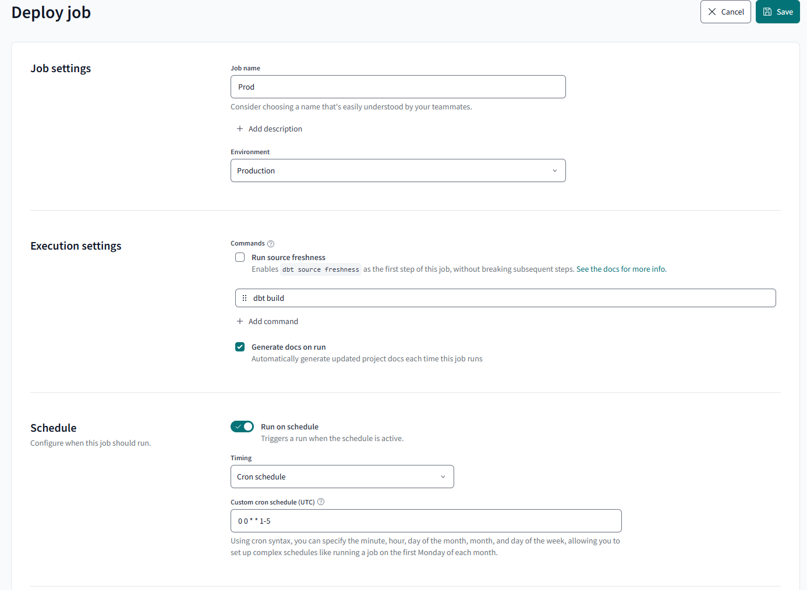
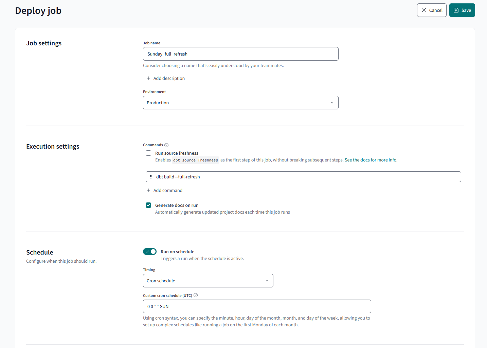

# Superstore Dimensional Model with dbt & Snowflake

**Objective: Create a new data workflow from a data dump in AWS that refreshes M-F and create a Tableau summary dashboard to capture high-level metrics associated with this data.**

**Note:** I get asked a lot about what a dbt developer does (mostly), and while this is not meant to be a tutorial but more so a simple walk-through at a high level of items that I typically utilize as an example of a process used for a standard dbt job. It may be a little messy right now, but it’ll get cleaned up! The order of things is mostly standard except for testing which I mention below. It is meant to be read before anything else.
It’s more of a checklist of basic items I use a lot.

## Project Overview

This project mimics some modern-day DataMart development that I typically do as a consultant (this is **pseudo** data but a similar process) and is an example of a star schema created from the Tableau Superstore data.
The dataset is cleaned beforehand since this was not the point of the exercise but rather to model and transform data as we would in a DataMart as a demonstration for a standard job that a client may choose to employ.

The process itself emulates a production-type ELT where a batch is loaded to Snowflake external stage and from there dbt takes over and transforms the data in three layers to create a star schema using Kimball architecture while utilizing some dbt best practices such as CI/CD pipelines, testing, using macros, documentation, and modularity.

First, dbt will transform the data by casting it to the correct values in a staging area while using the raw source data.
Once staged, generic and a few singular tests are run to adhere to dbt best practices. From here, model references to the stage data are used in creating intermediate models for the dimensions and fact table. This is where surrogate keys are added and any complex joins or logic is created.

Finally, the final fact and dimensions are created with a new set of generic tests, unit tests, custom tests, and some data governance best practices are applied as data contracts are enforced on the final models to ensure constraints and data types don’t change without being captured and documented.

The entire process is captured in documentation below for staging and for final fact/dim.
The jobs set up are for a production environment using a standard continuous deployment job for daily batching and a slim CI job that runs on any pull request to automatically integrate into production. There is also a weekly job that runs once every Sunday evening to do a full refresh for any data not captured incrementally through the week.


**Base Requirements:**

- Import source data from external stage in AWS S3 bucket.
- Layer architecture: stage, intermediate with business logic, consumption layer.
- Implement testing for sources from generic to custom to unit testing.
- Add third-party package for meta testing to ensure proper schema tests at stage layer.
- Clean and de-duplicate data as needed.
- Add type 2 slowly changing dimension to capture customer, product, and employee changes for a history table and current table.
- Add incremental model to capture new orders that are loaded.
- Create a dimensional model as tables for consumption layer.
- Add surrogate keys to each dimension and fact.
- Create documentation for all.
- Create a standard CI (continuous integration) job for any future changes.
- Create standard daily schedule for CD (continuous deployment) M-F.
- Create a full refresh job that occurs once weekly on Sundays to capture any increments that may have slipped through dev.
- Add data contracts to enforce constraints and satisfy stakeholder requirements at consumption layer.
- Create high-level Tableau Dashboard to cover basic KPI's.
  
**Note:**  *In a production-style process, we would have more steps like capacity planning where we nail down the volume, velocity, variety, and veracity of our data. We would also consider our integration strategy to understand formatting issues and naming standards.*

An example of the basic process flow is as follows:


### Subjects utilized in this project are as follows:

-	Layered Engineering with staging, intermediate, fact and dim models.
-	External staging with AWS.
-	Materializations: view to advanced incremental and type 2 SCD’s
-	Testing: generic, unit and custom are all utilized.
-	CI/CD job/environments set and used for dbt cloud.
-	Macros
-	Data contracts
-	Star Schema
-	Data Visualization with Tableau (exposures may be add here-TBD)
-	And nothing fancy happening with the SQL! Its all very basic.

*Additional Steps would also include capacity planning but given the inputs are pseudo, it’s hard to "pseudoize" the capacity plan, but realistically, we would just use a multiple on our average file size by cadence to gauge our compute usage.*

The goal here is to take some data, model it using a layered architecture while applying some software engineering best practices. We are going to set up a CI/CD job from start to finish with our finished product being a consumable star schema.

Why I incorporate layered architecture:

- Primarily b/c it is a best practice that allows us to separate concerns, use modularity and improve our maintainabilty of our code by allowing for independent developing, testing and modification of each layer. This makes for easier scaling and adaptibility to changing requirements that minimizes impacts on other parts of the system. 

**Key benefits of using layered architecture:**
- Separation of Concerns: Each layer focuses on a specific aspect of the application, preventing code mixing and simplifying logic management. 
- Improved Maintainability: Changes within a layer can be made without significantly affecting other layers, making maintenance easier. 
- Scalability: Individual layers can be scaled independently based on their specific load requirements. 
- Testability: Each layer can be tested individually, simplifying the testing process. 
- Reusability: Components within a layer can often be reused across different projects. 
- Team Collaboration: Different development teams can work on separate layers with minimal dependencies. 

Lets walk through the various layers used in this project:

## External Stage Set Up with Snowflake DDL

AWS S3 buckets are used to store files which mimics the “Load” portion of ELT after extraction from a source system (lets presume Talend dumps this data to S3). 

**Note:** I am not including a task and COPY command in my Snowflake set up b/c things vary so much at the phase! To get data from external or internal stage, I typically do use a task that fires a copy command to create my "raw" tables (you can also use a pipe w/cloud notifications) but that is a deeper Snowflake concept and somewhat outside the scope of what is intended to be a high level dbt sample project. The base DDL for the "raw" layer is included so lets just start there and definately look into tasks, things get really fun when automated data loads using task trees (this is usually figured out at ideation or beterr... once an understanding of cadence is established.).

To set up an external stage in AWS:
1. Create an external intergration object in Snowflake and also follow the steps in the DDL to do this in AWS S3
```SQL
CREATE OR REPLACE SCHEMA EXTERNAL_STGS;


CREATE STORAGE INTEGRATION s3_int
 type = external_stage
 storage_provider = 'S3'
 enabled = true
 storage_aws_role_arn = '<your arn from access role in aws >' -- remove this
 storage_allowed_locations = ('s3://superstore-data-dbt/load/' )
 ;


CREATE STAGE SUPERSTORE.EXTERNAL_STGS.s3_dbt_stage
 storage_integration = s3_int
 url = 's3:/your s3 buckett/load/'
 ;

-- now create the tables, A file format object and use copy into and tasks to automate as needed. .....
```
From here, DDL in Snowflake will create the basic stage tables (all as string a this layer) just to ingest the data into Snowflake. 
<a href='snowflake_set_up_aws_stage_ddl/snowflake_set_up_external_stage_ddl.sql'>See the snowflake ddl here</a>


## Define Sources

Fisrt thing we do is define our sources in a source.yml file. This allows us to use the ```sql{{ source() }}``` function to create dependencies in dbt. This step is crucial to setting up a good foundation for your project.

Sources example: (On a real project, I would most likely set up a separate test file for my sources). 

**Note:** we add the source freshness needed for incremental models. Thi stests the freshness of the dat. Below it is configured to throw a warning if the data is older than 1 day. 
```yml
version: 2

sources:
  - name: raw
    database: superstore  
    schema: raw  
    
    tables:
      - name: employees
      - name: orders
        freshness: # default freshness
          warn_after: {count: 24, period: hour}
        loaded_at_field: updated_at
```

Our source DAG at this point just shows orders and employees. Next our staging will expand on our layering.


## Stages and Materializations

Once the data is ingested in AWS and sourced in a yml file, the stage layer is created in dbt by applying light transformations and some aliasing to the stage models. We also utilize the ```sql {{ source(‘SCHEMA ‘ , ‘SOURCE TABLE’ ) }}``` function here to create our dependencies as the fist step of our DAG. All the business logic will be later applied in the intermediate layer. All models here are materialized as views. We don’t really care too much about the lag a view produces because this is our lightweight reference to the source data and we are in a dev environment. 

Below is how the materializations are set up in the dbt_project.yml

```yml
models:
  superstore:
    stg:
      +materialized: view
      +required_tests: {"unique.*|not_null": 1} # requires at least one og the following tests to be conducted on each model
    int:
      +materialized: view
    marts:
      dim:
        +materialized: table
      fct:
        +materialized: table
```
Staging code in dbt is really simple as we are just importing the data from the raw layer with some minor transformations. I always try to get my aliases and data types set here. 
  - One thing we dont want to do is modify too much here, this is your foundation to reference so keep it simple so we can easily reference the stage items.I usually will add some audit columns from Snowflake here as well.

Example stage import:
```sql
-- import raw orders to stage

with orders_stage as(
    select 
        *
    from 
        {{ source('raw', 'orders') }}
)

select 
    cast(row_id as int) as row_id,
    order_id,
    cast(order_date as date) as order_date,
    cast(ship_date as date) as ship_date,
    ship_mode,
    customer_id, 
    customer_name,
    sales_agent_id as emp_id,
    country_region,
    city,
    state,
    cast(postal_code as int) as postal_code,
    region,
    product_id,
    category,
    sub_category,
    product_name,
    cast( sales as decimal(20,2)) as sales,
    cast( quantity as integer) as quantity,
    cast( cost_percent as decimal(3,2)) as cost_percent,
    updated_at 
from orders_stage
```

The DAG in dbt now looks alittle bit like something is happening:


After creating stages (note: I usually run these tests on my sources but whatever works for you...), we run some basic tests to make sure our sources are not null and the unique keys are in fact unique. 
Often you can incorporate some accepted values tests here as well. This will help you catch changes from the source early on that may affect your downstream BI. We want to catch as much as possible early on before we materialize our final model in dimensions and facts. This avoids what can be nasty backfills and a backlog of meetings that give you nothing but headaches. 

*Each stage model gets its own test set up in a yml file, the employees is just one of several.*

<a href= 'models/stg'>see more testing source code here</a>
```yml
version: 2

models:
  - name: stg_employees
    description: Employees table that show employee information, mainly for tracking purposes in reporting. Type 2 SCD
    columns:
      - name: emp_id
        description: Primary key for employee table
        tests:
          - not_null
          - unique
      - name: first_name
        description: employees first name.
        tests:
          - not_null
      - name: last_name
        description: employees last name.
        tests:
          - not_null
      - name: age
        description: employees age.
        tests:
          - not_null   
      - name: hire_date
        description: date of employee hire, cannot be null.
        tests:
          - not_null
      - name: status
        description: employee status can be either A - active, T- terminated or LA leave of absence. Cannot be null.
        tests:
          - not_null
          - accepted_values:
              values: ['A', 'T', 'L/A', 'SB']
```

## Snapshots a.k.a type 2 Slowly Changing Dimensions for Change Data Capture

Why type 2 scd's? We use a type 2 as this is the default for dbt but it is also how we capture the history every time our data changes. For example, employees often change becasue they get promoted or leave via leave of abscence or attrition. 
We capture these changes every time they occur by adding a row to see that history for when they started, when it ended and the current status. 

Orders is the main file dump where all schema are derived from except employees (b/c this has additionla HR data that would typically get dumped or be its own extract separately in most cases anyhow).
That being said, Employees is a separate upload similar to a file or an ELT pull from Human Resources in a company.

Therefore, we extract all dimensions later from orders except employees. First, start with what might change and in this case, its the type 2 SCD's so we add them to the snapshots folder.


Example of the simple code import using CTE's (we utilize the ref() function to create additional dependencies in our DAG): SCD's are captured early, directly from source or stage layers, these are typically a first for me to work on. A best practice is to do this early in the process as we will add dome minor transformation at the intermediate layer before it is referenced at the consumption layer.

```sql
-- import employees file from raw dump in S3 to stage layer
with employees_stage as(
    select 
        *
    from 
        {{ source('raw', 'employees') }}
)
-- transform what we need with some small adjustments, add all aliases here.
select 
    cast(emp_id as int) as emp_id,
    name as first_name,
    surname as last_name,
    level,
    state,
    cast(age as int) as age,
    cast(hire_date as date) as hire_date,
    job_title,
    status,
    updated_at
from employees_stage
```

Once the stages are complete, type 2 slowly changing dimensnions are sent to the snapshots folder in dbt to capture any changes while 
The other models become intermediate models where we begin to apply business logic to create our consumption layer. The snapshots will also go through additional logic as they are imported to intermediate as well. We want to capture and add the is_current and end_dates.

The method used is the timestamp method in dbt (we can also use the columns strategy and provide a list of columns that may change if there is no timestamp colum.). The table is materialized in a file level configuration as a snapshot and written to a dedicated SCD schema. The customers and products table follow the same pattern as both have potential to change and the history should be captured.

Typically, these are pulling directly from the source data but in this case, one large table was broken down into dimensions and fact so the customers and products were a part of that and had to be broken down as stages first.
The employees is a separate file and was staged as such with all going dorectly to snapshots after testing.

**Note:** I also add a dedupe step here on snapshots. This application may have different placement or timing on other models but it always happens somewhere in the process.

```sql
-- note the scd snapshot uses a snapshot madcro and is run with by calling: dbt snapshot

-- creates type 2 slowly changing dimension for customers




{{
    config(
        target_database='superstore',
        target_schema='dev_snapshots',
        unique_key='emp_id',
        strategy='timestamp',
        updated_at='updated_at',
        invalidate_hard_deletes=True
    )
}}

-- create employees dim, this is an scd type 2
with emps_dedupe_dim as(
    select 
        *,
        row_number() over(partition by emp_id, first_name, last_name, level, state, age, hire_date, job_title, status order by emp_id) as total_rows
    from {{ ref('stg_employees') }}
)
select 
    emp_id,
    first_name,
    last_name,
    level,
    state,
    age,
    hire_date,
    job_title,
    status,
    updated_at
from emps_dedupe_dim
where total_rows = 1



```
To run in dev use:
Outside of this, dbt build will take care of the everything when you run it.
```sql
dbt snapshot
```

To mimic a source change (and to visualize it), the employee table is updated to reflect a promotion in by way of job title. This is doen in Snowflake with the following code: (Note this is the finsihed row level data.)

```sql
-- change an employees job title to 'SPB' due to a promotion 
update SUPERSTORE.RAW.EMPLOYEES
set job_title = 'SPB', updated_at = current_timestamp()
where emp_id = 2


-- check the change
select *
from SUPERSTORE.RAW.EMPLOYEES
where emp_id = 2


-- check changes in both table, this hist table will show the flags and history
select *
from SUPERSTORE.DEV.DIM_EMPLOYEES_HISTORY
where emp_id = 2
order by updated_at desc;
```


 

The final DAG will look like this as we add a currrent and history table (some emps leave, some are new etc so it changes a bit, your current only captures active emps where status =, 'A'):
 


To further demonstrate, we change a customers name as well by mimicking a source system update with some simple CRUD:

```sql
-- update raw tables to mimic source system updates
-- change a customers name where customer id = LO-17170, change to Loren Olson
update SUPERSTORE.RAW.ORDERS
set customer_name = 'Loren Olsen', updated_at = current_timestamp()
where customer_id = 'LO-17170';


-- check the change
select *
from SUPERSTORE.RAW.ORDERS
where customer_id = 'LO-17170'

-- see the cahnge in the dimension table
select *
from SUPERSTORE.DEV.DIM_CUSTOMERS_HISTORY
where customer_id = 'LO-17170'
order by 4 desc;
```

 

 The final DAG will look like this:


It’s notable that this data is taken early from our stage/source. We want to capture these changes early as dbt adds columns to track the date and the intermediate layer will add further transformations such as the “is_current” flag and it will also fill in the null date with a date that is extended far into the future so we can easily utilize the BETWEEN function when searching. Additionally, I add a row number function to deduplicate these records early just in case this happens. Sometimes our source data can do this and adding this step does no harm and can save you headaches later.


## Intermediate models - Applying Buiness Logic to Dimension and Fact Tables

Once we get the stages completed, we can start to implement business logic that captures and measures the business process as defined in any requirements by stakeholders/data consumers. This is where we start to refine things and model the data in a consumable way that downstream users will access via SQL queries. Note the fact below alos utilizes incrmental logic and surogate keys which will be discussed later.
    - By business logic, we are creating a production level star schema fro data consumers such as analysts and other future user taht will access with SQL.
    - Some orgs my choose to use ephemeral models here but keep in ind, this can be hard to debug and really wrecks your testing.

Example: adding incremental logic in an intermediate step while also creating surrogates to macth dimesions. 
  - several things to note here:
    - We use a strategy using the primary key for the incrment
    - the schema change is set tp fail if there are any changes. This lets us catch changes beforer they go into prod w/o anyone knowing.
    -  the model uses {{ this }} to reference itself by taking the max date of reference from the model (not inclusive of the current load date).
    -  
I typically focus on what would be my fact table and apply the incrm,emtal strategy and tes it... alot! You don't want backfills every week.
   - For this I usually hvae the ERD laid out already, its below and would be done alreadya as it is typically a pahse that occurs just after the conceptual/iteration/capacity planning. Wwe raent hitting every step here b/c its just a simple demo that mimics some of my standard process.
```sql
-- create fact table: this needs to be set up as incremental

{{ 
    config(
        target_schema = 'inc_models',
        materialized = 'incremental', 
        unique_key = 'fct_primary_key',
        on_schema_change ='fail'
    ) 
}}

-- adds dupe check
with orders_dedupe_fact as(
    select 
        *,
        row_number() over(partition by order_id, order_date, ship_date, ship_mode, sales, quantity, cost_percent order by order_id) as total_rows
    from {{ ref('stg_orders') }}
),

-- gets only unique rows from dedupe fact
de_duped as(
    select *
    from orders_dedupe_fact
    where total_rows = 1
),

-- adds increment step after deduped so it is readay for testing before prod
increment_fct as (
    select 
        {{ dbt_utils.generate_surrogate_key(['order_id', 'order_date', 'updated_at']) }} AS fct_primary_key,
        {{ dbt_utils.generate_surrogate_key(['customer_id', 'customer_name']) }} as cust_surr_id,
        order_id,
        customer_id,
        YEAR(order_date) * 10000 + MONTH(order_date) * 100 + DAY(order_date) AS order_date_id,
        YEAR(ship_date) * 10000 + MONTH(ship_date) * 100 + DAY(ship_date) AS ship_date_id,
        ship_mode,
        emp_id,
        {{ dbt_utils.generate_surrogate_key(['country_region', 'state', 'city', 'postal_code', 'region']) }} as location_surr_id,
        {{ dbt_utils.generate_surrogate_key(['product_id', 'category', 'sub_category', 'product_name']) }} as prod_surr_id,
        sales,
        quantity,
        cost_percent,
        updated_at
    from de_duped

     

            WHERE updated_at >= (SELECT MAX(updated_at) FROM {{ this }} )

     
)

-- final query
select *
from increment_fct 

```

### Add dimensions for additional context
- The dims add comtext to our facts so its important we implement this as we progress through our layered architecture.
  
To further show how the intermediate layer adds complexity, the date spline package was used to create a date range which is just a simple date. Uisng this, the date was broken down into its lowest form for anytype of time series analysis our user wants to conduct, even wekend and holicday flags. Thats complex logic and needs to be unit tested.  The process was developed using test driven developement before actually writing any SQL. See unit testing below. Here is an example of the complex sql used:
```sql

-- creates date table to exctract whatver you need for any date analysis, includes weekend day flag and holiday flag. Created from date spline package.
with 
    dim_dates as(
        select 
        year(date_day) * 10000 + month(date_day) * 100 + day(date_day) as date_id,
        date_day,
        year(date_day) as yr,
        quarter(date_day) as quarter_of_yr,
        month(date_day) as mth,
        weekofyear(date_day) as wk_of_yr,
        dayofweek(date_day) as day_of_wk,
            case 
                when cast(dayofweek(date_day) as string ) = '0' then 'sunday' 
                when cast(dayofweek(date_day) as string ) = '1' then 'monday'
                when cast(dayofweek(date_day) as string ) = '2' then 'tuesday'
                when cast(dayofweek(date_day) as string ) = '3' then 'wednesday'
                when cast(dayofweek(date_day) as string ) = '4' then 'thursday'
                when cast(dayofweek(date_day) as string ) = '5' then 'friday'
            else 'saturday'
        end as day_name,
            case when dayofweek(date_day) in (0,6) then 1 else 0 end as weekend_flag,
            case 
                when month(date_day) in(1) and day(date_day) in(01) then 1 
                when month(date_day) in(1) and day(date_day) in(18) then 1
                when month(date_day) in(5) and day(date_day) in(31) then 1
                when month(date_day) in(6) and day(date_day) in(19) then 1
                when month(date_day) in(7) and day(date_day) in(4) then 1
                when month(date_day) in(9) and week(date_day) in (35) and dayofweek(date_day) in(0,1) then 1 -- labor day is always 1st monday in september, week 35
                when month(date_day) in(11) and day(date_day) in(11) then 1 
                when month(date_day) in(11) and week(date_day) in(48) and dayofweek(date_day) in (4) then 1 -- tg day is always last thursday of novemeberr, week 48
                when month(date_day) in(12) and day(date_day) in(25) then 1
                else 0
        end as holiday_flag,
        current_timestamp() as refreshed_at
        from {{ ref('stg_all_dates') }}
)

select * 
from dim_dates
```

## Building the Dimensional Model in our Consumption Layer

Why do we do this? This (a star schema) has become a standard for intuitive and functionaly performant data consumption from our downstream users. Given we do the SCD's and the join logic, the heacy lifting so to sepak is domne and the data is denormalized so its easier to understand. Not to mention, in dimensional modeling, we are attempting to always capture a business process to measure. Our fact does just this and our dimensions add contex to our fact. In short, this make things really easy to understand and document for our stakeholders/downstream data consumers. It also lessens the burden of utilizing a lot of joins for one ad hoc report or standard business intellifence on a normal cadence.

Additionally, we add contracts to this layer to ensure and enforce constrainst/data types for consistency. Documentation is also a key factor here so we can define everything for our downstream users. The theme here is to really understand our data consumers (though this not entirtely possible, we do our best) and keep it simple. The more complexity you add, the hard thingsd get to fix laster for someome else that  may not understaqnd your logic at all. 

The outcome we expect is a data model found in the below entity relatonship diagram:

The star schema model that is being engineered is as follows:


## dbt Tests - Generic to Unit Testing

Testing is one of the fundamental core pieces of dbt and is  software engineerning best practice. Every model should incorporate at least a unique and/or not null test.
    - Keep in mind, we often dont need hundresedd of tests, we juwt need really good tests at the right moments!
    - Fundamaental tests like unique and not null a always a must and typically I use a thord party package called metatesting to ensure I have at least one of these for each model that I stage.
    - I dind its also vital to test values that should be greater than 0 or what woud  be considered an accepted value frjm the business (such as order status).
    - I also like to add a unit test for any logic that is considered advanced to test my assertions and catch any potential edge cases. In this exmaple, I unit test my date dimenesion becasue it is complex and \
      I want to ensure my users are getting the required functionality for date searches.

I generally stick to the theme below for testing with some minor variations:

**Note:** I run tests early and often. This visual and section may appear here but this is just to demonstrate and cluister the examples under this topic. This is applied throughout the project at the varopis layers as demonstrated in the visual or in the yml files.

source: https://docs.getdbt.com/blog/test-smarter-where-tests-should-go

Generic Example that uses unique, not_null and accepted values at the stage layer:
```yml
version: 2

models:
  - name: stg_employees
    description: Employees table that show employee information, mainly for tracking purposes in reporting. Type 2 SCD
    columns:
      - name: emp_id
        description: Primary key for employee table
        tests:
          - not_null
          - unique
      - name: first_name
        description: employees first name.
        tests:
          - not_null
      - name: last_name
        description: employees last name.
        tests:
          - not_null
      - name: age
        description: employees age.
        tests:
          - not_null   
      - name: hire_date
        description: date of employee hire, cannot be null.
        tests:
          - not_null
      - name: status
        description: employee status can be either A - active, T- terminated or LA leave of absence. Cannot be null.
        tests:
          - not_null
          - accepted_values:
              values: ['A', 'T', 'L/A', 'SB']

```


At the intermediate layer, its gets slightly more complicated becasue I use a custom test macro. For this I use:

```yml
version: 2

# this tests the intermediate layer before it moves to the final prod layer, if it fails then no load, similar to WAP.

models:
  - name: int_fct_orders
    description: fact table for orders
    columns:
      - name: sales
        description: sales amount of the orders
        tests:
         - not_null
         - positive_value
      - name: quantity
        description: the number of items in the order
        tests:
         - not_null
         - positive_value       
```
The above tests are derived from a custome test macro and test that the column has a value greater tahn zero. This runs as applied above to a column and is triigered by dbt build or test.

```sql
-- applies to all numeric cols with a count, date math or a dolar amount

    with gte_zero as(
        select  *
        from {{ model }}
        where {{ column_name}} <= 0
)

select * from gte_zero


```
At the consumption layer (dim/fact), I will look to test two things, relationships (aka referential integrity) and unit test complex logic:

**Unit Tests and Test-Driven Development**
- The unit test is typically used for test driven development meaning we make the test first and then development the model by incorporatng that same logic.
- The date dimesnion has som ecomplexity to it and is a great candiate with several case statements and flags, all fields are derived from one date field whic mkaes ourinput simple.
- The unit test is meant to capture edge cases that fall outside our assumptions.

Example of the actual untit test for the dim date model (not this is conducted at the intermediate level before the dim is built):
```yml
unit_tests:
  - name: test_date_dimension_logic
    description: >
      Validate logic in the date dimension model given it is a bit complex, holiday flags, 
      weekend flags, are completed as custome tests given week one is actually 52 and requires customization as do flags.
    model: int_dim_date
    given:
      - input: ref('stg_all_dates')
        rows:
          - {date_day: '2024-01-01'}
          - {date_day: '2024-07-04'}
          - {date_day: '2024-12-25'}
          - {date_day: '2024-11-28'}
          - {date_day: '2024-09-01'}
          - {date_day: '2024-09-02'}
          - {date_day: '2024-11-11'}
          - {date_day: '2024-05-31'}
          - {date_day: '2024-06-01'}
          - {date_day: '2024-06-02'}
          - {date_day: '2024-06-19'}
    expect:
      rows:
        - {date_day: '2024-01-01', date_id: 20240101, yr: 2024, quarter_of_yr: 1, mth: 1,  day_of_wk: 1, day_name: 'monday', weekend_flag: 0, holiday_flag: 1}
        - {date_day: '2024-07-04', date_id: 20240704, yr: 2024, quarter_of_yr: 3, mth: 7,  day_of_wk: 4, day_name: 'thursday', weekend_flag: 0, holiday_flag: 1}
        - {date_day: '2024-12-25', date_id: 20241225, yr: 2024, quarter_of_yr: 4, mth: 12, day_of_wk: 3, day_name: 'wednesday', weekend_flag: 0, holiday_flag: 1}
        - {date_day: '2024-11-28', date_id: 20241128, yr: 2024, quarter_of_yr: 4, mth: 11, day_of_wk: 4, day_name: 'thursday', weekend_flag: 0, holiday_flag: 1}
        - {date_day: '2024-09-01', date_id: 20240901, yr: 2024, quarter_of_yr: 3, mth: 9,  day_of_wk: 0, day_name: 'sunday', weekend_flag: 1, holiday_flag: 1}
        - {date_day: '2024-09-02', date_id: 20240902, yr: 2024, quarter_of_yr: 3, mth: 9,  day_of_wk: 1, day_name: 'monday', weekend_flag: 0, holiday_flag: 0}
        - {date_day: '2024-11-11', date_id: 20241111, yr: 2024, quarter_of_yr: 4, mth: 11, day_of_wk: 1, day_name: 'monday', weekend_flag: 0, holiday_flag: 1}
        - {date_day: '2024-05-31', date_id: 20240531, yr: 2024, quarter_of_yr: 2, mth: 5,  day_of_wk: 5, day_name: 'friday', weekend_flag: 0, holiday_flag: 1}
        - {date_day: '2024-06-01', date_id: 20240601, yr: 2024, quarter_of_yr: 2, mth: 6,  day_of_wk: 6, day_name: 'saturday', weekend_flag: 1, holiday_flag: 0}
        - {date_day: '2024-06-02', date_id: 20240602, yr: 2024, quarter_of_yr: 2, mth: 6,  day_of_wk: 0, day_name: 'sunday', weekend_flag: 1, holiday_flag: 0}
        - {date_day: '2024-06-19', date_id: 20240619, yr: 2024, quarter_of_yr: 2, mth: 6,  day_of_wk: 3, day_name: 'wednesday', weekend_flag: 0, holiday_flag: 1}
```

Week is not part of this test as the the unit test was capturing January 1st 2024 as week 1 when its actually still part week 52 of 2023. That is certainly an edge case (revealed by the UT)!
However, this was a great candidate for a custom test with one specific task in mid.

```sql
with week_test as (

    select
        *
    from 
        {{ ref('int_dim_date') }}
    where wk_of_yr != week(date_day) -- does my week match the ANSI standard week?

)

select * from week_test
```
A quick DAG view of the unit test in action is below: if the test fails, the model does not build!


To test referential integrity, I am using a basic relationship test from dbt after incorporating surrogate keys because the design of the star schema requires a relationship from the fact to the dimensions via surrogate key that I created in dbt.

Test relationships on fact (note contracts are added later and in the final version):

```yml
version: 2
# this example is only a relationship tes, final version ahs contracts added
models:
  - name: fact_orders
    description: Fact table for orders.
    columns:
      - name: fct_primary_key
        description: Primary key for fact table.
        data_type: varchar
        tests:
          - not_null 
          - unique
      - name: cust_surr_id
        description: the foreign key to the customers dimension.
        data_type: varchar
        tests:
          - relationships:
              field: cust_surr_id
              to: ref('dim_customers_current')
      - name: order_date_id
        description: The foriegn key to the date dimension whihc allows the id of varius date attributes from bus day to holiday to month to quarter etc.
        data_type: number
        tests:
          - relationships:
              field: date_id
              to: ref('dim_date')
      - name: ship_date_id
        description: Foreign key to date table.
        data_type: number
        tests:
          - relationships:
              field: date_id
              to: ref('dim_date')
      - name: location_surr_id
        description: The location id, foriegn key to location dimension.
        tests:
          - relationships:
              field: location_surr_id
              to: ref('dim_location')
        data_type: varchar
      - name: prod_surr_id
        description: The product identifier, foriegn key to products dimension.
        data_type: varchar
        tests:
          - relationships:
              to: ref('dim_products_current')
              field: prod_surr_id
      - name: customer_id
        description: The customer id, foreign key to customers dimension.
        data_type: varchar
        tests:
          - relationships:
              field: customer_id
              to: ref('dim_customer_current')
      - name: emp_id
        description: The employee id - foriegn key to employees dimension.
        data_type: varchar
        tests:
          - relationships:
              field: emp_id
              to: ref('dim_employees_current')
    
```

Overall, this project has 155 total tests. All of which have passed. Testing is crucial to building a successful project with data!.


From here, the consumption layer is created by importing our data from the intermediate layer where all the heavy lifting is done. Tables can be pulled to a prod database from here, and often this is a great place to get some user feedback or UAT testing in from your downstream data consumers (I use a select few for this at this layer before pushing to prod; this allows for one last attempt at stakeholder feedback).

Typically, the are materialized as tables and preficed as dim_table_name and fact_table_name to clearly call out the star schema that our downstream users can readily identofy for their analysis.

## Data Mesh

To enforce constraints, data contracts were used at the consumption layer. These are used to ensure the LOB will have some consistency in the data served to their users. If the data type is changed, the test will throw an error and the model will not materialize which triggers a review for the dev team. This protecst the consumption layer from incosistenices and potential errors or unknown changes that have negative downstream impqacts that no one knows is a problem unitl it becomes a majpr headache. Note: they are combined in the final yml file with the final testing.
```yml
version: 2

# this tests the intermediate layer before it moves to the final prod layer, if it fails then no load, similar to WAP.

models:
  - name: int_fct_orders
    description: fact table for orders
    columns:
      - name: fct_primary_key
        tests:
          - unique  
          - not_null
      - name: cust_surr_id
        description: customer surrogate key that relates to customers table
        tests:
         - not_null
      - name: order_id
        description: unique aplha-numeric for the order
        tests:
         - not_null
         - unique  
      - name: order_date_id
        description: foreign key to date dimension
        tests:
         - not_null
      - name: ship_date_id
        description: foreign key to date dimension - join twice ot get both order/ship
        tests:
         - not_null
      - name: ship_mode
        description: method of shipping used for the order
        tests:
         - not_null
      - name: emp_id
        description: primary key to employees dimension
        tests:
         - not_null
      - name: location_surr_id
        description: foreign key to location dimension 
        tests:
         - not_null
      - name: prod_surr_id
        description: foreign key to product dimension 
        tests:
         - not_null
      - name: sales
        description: sales amount of the orders
        tests:
         - not_null
         - positive_value
      - name: quantity
        description: the number of items in the order
        tests:
         - not_null
         - positive_value
      - name: cost_percent
        description: the percentage of the order that is attributed to the overall cost of production
        tests:
         - not_null
      - name: updated_at
        description: batch load date - will differ as batches arrive daily
        tests:
         - not_null
      
```

## Documentation

Along the way for each step/layer, I document everything by using the "description" in every yml file for every column or table. We need to be mindful of our audience. Typically, at the stage layers or intermediate layer, developers will be our auduence so we try to add wht we think can best help them. Below is an example of documentation in dbt cloud. You can get way more elaborate with overviews and descriptions but I tend to keep it simple b/c it takes time away from dev and well...., that is generally the strength for most of us.

dbt docs allow us to:
- Capture tablelevel descriptions
- Capture column level descriptions
- Capture column level test descriptions
- Models referenced
- Code
- DAG visuals like below

Example of the finished DAG from dbt docs:


Example of table level docs in dbt cloud:


## Deployment

The last very important part of using dbt -  CI/CD part of your pipeline!

Typically, we develop three different jobs. 
  - Continuous delivery (Slim CI job triggered on a pull request/merge after testing passes for new changes)
  - Continous deployment (M-F at 12am)
  - Weekly full refresh (in case of missing increments)

CI Example (on merge):


CD Example -  M-F at 12am:


Weekly Full Refresh (Sundays only)


Succcessul Run Example: (the warnings are from an unused path that was not configured, nothing material)


## Tableau Dashboard (hosted on Tableau Public)

This is just a placeholder while the actual dashboard is being developed from the data used for this project. This is a simple version, whereas the actual version is developed using the model data above and will have much more detail and various grain layers to tell a deeper story. This Dashboard pulls its data on a daily refresh after the dbt job(s) have run and updates on an automated schedule. It uses a materialized view to pull its components that create the dash. I do this to minimize the calculations Tableau has to complete to speed up its rendering.

https://public.tableau.com/views/superstore_17058800874340/Dashboard1?:language=en-US&:sid=&:redirect=auth&:display_count=n&:origin=viz_share_link


<div class='tableauPlaceholder' id='viz1734287914112' style='position: relative'><noscript><a href='#'></a></noscript><object class='tableauViz'  style='display:none;'><param name='host_url' value='https%3A%2F%2Fpublic.tableau.com%2F' /> <param name='embed_code_version' value='3' /> <param name='site_root' value='' /><param name='name' value='superstore_17058800874340&#47;Dashboard1' /><param name='tabs' value='no' /><param name='toolbar' value='yes' /><param name='static_image' value='https:&#47;&#47;public.tableau.com&#47;static&#47;images&#47;su&#47;superstore_17058800874340&#47;Dashboard1&#47;1.png' /> <param name='animate_transition' value='yes' /><param name='display_static_image' value='yes' /><param name='display_spinner' value='yes' /><param name='display_overlay' value='yes' /><param name='display_count' value='yes' /><param name='language' value='en-US' /></object></div>                


## Conclusion

Throughout this example, the basics of dbt are covered and about 85% of the time, you will use all of these concpets in practice when using dbt to model data.

To recap topics covered:
1. external stages/raw layers/sources
2. layers of architecture
3. testing - generic, unit, custom and third party
4. documentation
5. deployment for CI/CD pipeline orchestration

I also use some surogate keys but font elaborate on them much as thta is a Kimbal Modeling technique that you can read up on. I would highly recommend trying some dbt courses out in the cloud version. Its really fun and there is a ton to learn!
Visit dbt's learn center <a href='https://learn.getdbt.com/catalog'>here.</a> And mostly, just have fun doing it. It takes a while to really learn and be able to implement the fundamental principles professionally. dbt really mixes the best of software engineering and data engineering into one fun tool!
