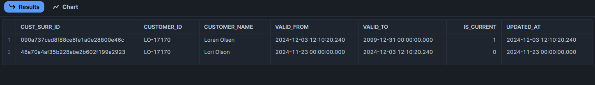

# Superstore Dimensional Model with dbt & Snowflake

Objective: Create a star schema for business to utilize various business intelligence and create a Tableau summary dashboard to capture high level metrics.

## Overview

This project mimics some modern day DataMart development and is an example of a star schema is created from the Tableau Superstore data. The dataset is cleaned beforehand since this was not the point of the exercise but rather to model and transform data as we would in a DataMart as a demonstration for a standard job that a client may choose to employ. 

The process itself emulates a production type ELT where a batch is loaded to Snowflake external stage and from there dbt takes over and transforms the data in three layers to create a star schema using Kimball architecture while utilizing some dbt best practices such as CI/CD pipelines, testing, using macros, documentation and modularity. 

First, dbt will transform the data by casting it the correct values in a staging area while using the raw source data. 
Once staged, generic and a few singular tests are run to adhere to dbt best practices. From here, model references to the stage data are used in creating intermediate models for the dimensions and fact table. This is where surrogate keys are added and any complex joins or logic is created. 

Finally, the final fact and dimensions are created with a new set of generic tests, unit tests, custom tests and some data governance best practices  are applied as data contracts are enforced on the final models to ensure constraints and data types don’t change without be captured and documented.

The entire process is captured in documentation below for staging and for final fact/dim.
The jobs set up are for a production environment using a standard deployment job for daily batching and a slim CI job that runs on any pull request to automatically integrate into production.

An example of the basic process flow is as follows:


### Subjects utilized in this project are as follows:

-	Layered Engineering with staging, intermediate, fact and dim models.
-	External staging with AWS.
-	Materializations: view to advanced incremental and type 2 SCD’s
-	Testing: generic, unit and custom are all utilized.
-	CI/CD job/environments set and used for dbt cloud.
-	Macros
-	Data contracts
-	Star Schema
-	Data Visualization with Tableau (exposures may be add here-TBD)
-	And nothing fancy happening with the SQL! Its all very basic.

*Additonal Steps would also include capacity planning but given the inputs are psuedo, its hard to "psuedoize" the capacity plan but realistically, we would just use a mutiple on our average file size by cadence.*

*******Dicuss layers and then eas into below model as finished product.******

The outcome we expect is a data model found in the below entity relatonship diagram:


The model that is being engineered is as follows:


## External Stage Set Up with Snowflake DDL

AWS S3 buckets are used to store files which mimics the “Load” portion of ELT. 
From here, DDL creates basic stage tables (all as string a this layer) o ingest the data into Snowflake. 

## Stages Materialized (Stage Layer)

Once the data is ingested in AWS,  the stage layer is created in dbt by applying light transformations and some aliasing to the stage models. We also utilize the {{ source(‘SCHEMA ‘ , ‘SOURCE TABLE’ ) }} function here to create our dependencies as the fist step of our DAG. All the business logic will be later applied in the intermediate layer. All models here are materialized as views. We don’t really care too much about the lag a view produces because this is our lightweight reference to the source data and we are in a dev environment. 

**DAG SS**

**Example code to materialize views (easy import of source data.**
Each cource is imported into its stage. Producst amd Customers are derived from the orders file 
with Employees being a separate uplaod similar to a file or an ELT pull from Human Resources in a company.

Example of the simple code import using CTE's:
```sql
-- import employees file to stage layer
with employees_stage as(
    select 
        *
    from 
        {{ source('raw', 'employees') }}
)

select 
    cast(emp_id as int) as emp_id,
    name as first_name,
    surname as last_name,
    level,
    state,
    cast(age as int) as age,
    cast(hire_date as date) as hire_date,
    job_title,
    status,
    updated_at
from employees_stage
```

Once the stages are complete, type 2 slowly changing dimemsnions are sen to snapshots to capture any changes while 
The other models become intermedoate models where we begin to apply business logic to create our consumption layer.
**summary screensnip**

After creating stages, we run some basic tests to make sure our sources are not null and the unique keys are in fact unique. 
Oten you can incorporate some accepted values tests here as well. This will help you catch changes from the source early on that may affect your downstream BI. We want to catch as much as possible early on before we materialize our final model in dimensions and facts. This avoids what can be nasty backfills and a backlog of meetings that give you nothing but headaches. 

*Each stage model gets its own test set up in a yml file, the employees is just one of several.*
```yml
version: 2

models:
  - name: stg_employees
    description: Employees table that show employee information, mainly for tracking purposes in reporting. Type 2 SCD
    columns:
      - name: emp_id
        description: Primary key for employee table
        tests:
          - not_null
          - unique
      - name: first_name
        description: employees first name.
        tests:
          - not_null
      - name: last_name
        description: employees last name.
        tests:
          - not_null
      - name: age
        description: employees age.
        tests:
          - not_null   
      - name: hire_date
        description: date of employee hire, cannot be null.
        tests:
          - not_null
      - name: status
        description: employee status can be either A - active, T- terminated or LA leave of absence. Cannot be null.
        tests:
          - not_null
          - accepted_values:
              values: ['A', 'T', 'L/A', 'SB']
```


## Slowly Changing Dimensions

The employees for Supestore are broken into a separate Dimension that is a type 2 slowly changing dimension. The method used is the timestamp method in dbt. The table is materialized in a file level configuration as a snapshot and written to a dedicated SCD schema. The customers and products table follow the same pattern as both have potential to change and the history should be captured.
Typically, these are pulling directly from the source data but in this case, one large table was broken down into dimensions and fact so the cutomers and prodcuts were aprt of that and had to be broken down as stages first.
The employees is a separate file and was staged as such with all going dorectly to snapshots after testing.

To mimic a source change, the employee table is updated to reflect a promotion in by way of job title. This is doen in Snowflake with the following code:

```sql
-- change an employees job title to 'SPB' due to a promotion 
update SUPERSTORE.RAW.EMPLOYEES
set job_title = 'SPB', updated_at = current_timestamp()
where emp_id = 2


-- check the change
select *
from SUPERSTORE.RAW.EMPLOYEES
where emp_id = 2


-- check changes in both table, this hist table will show the flags and history
select *
from SUPERSTORE.DEV.DIM_EMPLOYEES_HISTORY
where emp_id = 2
order by updated_at desc;
```


 The final DAG will look like this:


To further demonstrate, we change a customers name as well by mimicking a source system update with some simple CRUD:
```sql
-- update raw tables to mimic source system updates
-- change a customers name where customer id = LO-17170, change to Loren Olson
update SUPERSTORE.RAW.ORDERS
set customer_name = 'Loren Olsen', updated_at = current_timestamp()
where customer_id = 'LO-17170';


-- check the change
select *
from SUPERSTORE.RAW.ORDERS
where customer_id = 'LO-17170'

-- see the cahnge in the dimension table
select *
from SUPERSTORE.DEV.DIM_CUSTOMERS_HISTORY
where customer_id = 'LO-17170'
order by 4 desc;
```

 

 The final DAG will look like this:


It’s notable that this data is taken early from our stage/source. We want to capture these changes early as dbt adds columns to track the date and the intermediate layer will add further transformations such as the “is_current” flag and it will also fill in the null date with a date that is extended far into the future so we can easily utilize the BETWEEN function when searching. Additionally, I add a row number function to deduplicate these records early just in case this happens. Sometimes our source data can do this and adding this step does no harm and can save you headaches later.


## Intermediate models

Once we get the stages completed, we can start to implemet business logic that captures and measures the business process as defined in any requirements.
** add screenshots, several dim date etc **

## Dbt Tests

summary screensnip audit helper results snip
Generic Example at the stage layer:
```yml
version: 2

models:
  - name: stg_employees
    description: Employees table that show employee information, mainly for tracking purposes in reporting. Type 2 SCD
    columns:
      - name: emp_id
        description: Primary key for employee table
        tests:
          - not_null
          - unique
      - name: first_name
        description: employees first name.
        tests:
          - not_null
      - name: last_name
        description: employees last name.
        tests:
          - not_null
      - name: age
        description: employees age.
        tests:
          - not_null   
      - name: hire_date
        description: date of employee hire, cannot be null.
        tests:
          - not_null
      - name: status
        description: employee status can be either A - active, T- terminated or LA leave of absence. Cannot be null.
        tests:
          - not_null
          - accepted_values:
              values: ['A', 'T', 'L/A', 'SB']

```

Testing relationships at the intermediate layer:


Testing positive values by creating a macro to be used in several places:
```sql
-- applies to all numeric cols with a count, date math or a dolar amount

    with gte_zero as(
        select  *
        from {{ model }}
        where {{ column_name}} <= 0
)

select * from gte_zero


```

Applying the positve values in the yml file:
```yml
  - name: quantity
        tests:
          - positive_value
      - name: sales
        tests:
          - positive_value
```

Unit Tests:
- The unit test is typically used for test driven development meaning we make the test first and then development the model by incorporatng that same logic.
- The date dimesnion has som ecomplexity to it and is a great candiate with several case statements and flags, all fields are derived from one date field whic mkaes ourinput simple.
- The unit test is meant to capture edge cases that fall outside our assumptions.

Example of the actual untit test for the dim date model (not this is conducted at the intermediate level before the dim is built):
```yml
unit_tests:
  - name: test_date_dimension_logic
    description: >
      Validate logic in the date dimension model given it is a bit complex, holiday flags, 
      weekend flags, are completed as custome tests given week one is actually 52 and requires customization as do flags.
    model: int_dim_date
    given:
      - input: ref('stg_all_dates')
        rows:
          - {date_day: '2024-01-01'}
          - {date_day: '2024-07-04'}
          - {date_day: '2024-12-25'}
          - {date_day: '2024-11-28'}
          - {date_day: '2024-09-01'}
          - {date_day: '2024-09-02'}
          - {date_day: '2024-11-11'}
          - {date_day: '2024-05-31'}
          - {date_day: '2024-06-01'}
          - {date_day: '2024-06-02'}
          - {date_day: '2024-06-19'}
    expect:
      rows:
        - {date_day: '2024-01-01', date_id: 20240101, yr: 2024, quarter_of_yr: 1, mth: 1,  day_of_wk: 1, day_name: 'monday', weekend_flag: 0, holiday_flag: 1}
        - {date_day: '2024-07-04', date_id: 20240704, yr: 2024, quarter_of_yr: 3, mth: 7,  day_of_wk: 4, day_name: 'thursday', weekend_flag: 0, holiday_flag: 1}
        - {date_day: '2024-12-25', date_id: 20241225, yr: 2024, quarter_of_yr: 4, mth: 12, day_of_wk: 3, day_name: 'wednesday', weekend_flag: 0, holiday_flag: 1}
        - {date_day: '2024-11-28', date_id: 20241128, yr: 2024, quarter_of_yr: 4, mth: 11, day_of_wk: 4, day_name: 'thursday', weekend_flag: 0, holiday_flag: 1}
        - {date_day: '2024-09-01', date_id: 20240901, yr: 2024, quarter_of_yr: 3, mth: 9,  day_of_wk: 0, day_name: 'sunday', weekend_flag: 1, holiday_flag: 1}
        - {date_day: '2024-09-02', date_id: 20240902, yr: 2024, quarter_of_yr: 3, mth: 9,  day_of_wk: 1, day_name: 'monday', weekend_flag: 0, holiday_flag: 0}
        - {date_day: '2024-11-11', date_id: 20241111, yr: 2024, quarter_of_yr: 4, mth: 11, day_of_wk: 1, day_name: 'monday', weekend_flag: 0, holiday_flag: 1}
        - {date_day: '2024-05-31', date_id: 20240531, yr: 2024, quarter_of_yr: 2, mth: 5,  day_of_wk: 5, day_name: 'friday', weekend_flag: 0, holiday_flag: 1}
        - {date_day: '2024-06-01', date_id: 20240601, yr: 2024, quarter_of_yr: 2, mth: 6,  day_of_wk: 6, day_name: 'saturday', weekend_flag: 1, holiday_flag: 0}
        - {date_day: '2024-06-02', date_id: 20240602, yr: 2024, quarter_of_yr: 2, mth: 6,  day_of_wk: 0, day_name: 'sunday', weekend_flag: 1, holiday_flag: 0}
        - {date_day: '2024-06-19', date_id: 20240619, yr: 2024, quarter_of_yr: 2, mth: 6,  day_of_wk: 3, day_name: 'wednesday', weekend_flag: 0, holiday_flag: 1}
```

Week is not part of this test as the the unit test was capturing January 1st 2024 as week 1 when its actually week 2 of 2023. That is certainly an edge case!
However, this was a great candiate for a custom test with one specific task in mid.

```sql
with week_test as (

    select
        *
    from 
        {{ ref('int_dim_date') }}
    where wk_of_yr != week(date_day) -- does my week match the ANSI standard week?

)

select * from week_test
```
## dimensional models

** talk hist tables and current for scd **
•	surrorate keys

## Data Mesh
summary screen snip
•	model contracts
•	groups

## Documentation

## Deployment

summary screen snips

## Tableau Dashboard
link to dash


